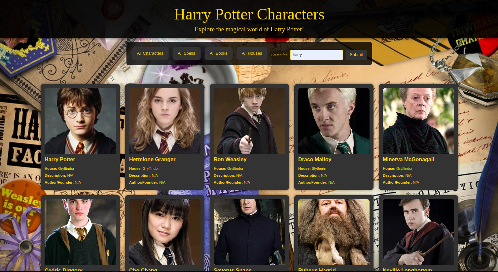

# Harry-Potter-app# Harry Potter App

A Harry Potter-themed web application that allows users to explore characters, spells, books, and houses from the magical world of Harry Potter.



## Table of Contents
- [Harry-Potter-app# Harry Potter App](#harry-potter-app-harry-potter-app)
  - [Table of Contents](#table-of-contents)
  - [Features](#features)
  - [Demo](#demo)
  - [Installation](#installation)
  - [Usage](#usage)
  - [File Structure](#file-structure)
  - [Technologies Used](#technologies-used)
  - [License](#license)

## Features
- View detailed information about Harry Potter characters, spells, books, and houses.
- Search functionality to quickly find characters, spells, books, or houses.
- Responsive design for an optimal user experience on any device.

## Demo
Check out the live demo [here](https://orhanguezel.github.io/Harry-Potter-app/).

## Installation
To set up the project locally:

1. Clone the repository:
   ```bash
   git clone https://github.com/Orhanguezel/Harry-Potter-app.git
   ```

2. Navigate to the project directory:
   ```bash
   cd Harry-Potter-app
   ```

3. Install dependencies:
   ```bash
   npm install
   ```

4. Start a local server or deploy to view the app.

## Usage
- Open `index.html` in your browser to run the application locally.
- Use the navigation buttons to explore characters, spells, books, or houses.
- Search for specific entities using the search bar.

## File Structure
```plaintext
Harry-Potter-app/
├── assets/
│   ├── demo.png                # Demo screenshot
│   ├── harry-potter-desk-wallpaper.jpg  # Background image
├── node_modules/               # Dependencies
├── scripts/
│   ├── script.js               # JavaScript functionality
├── styles/
│   ├── style.css               # Styling for the app
├── index.html                  # Main HTML file
├── README.md                   # Documentation
├── package.json                # Project configuration
├── package-lock.json           # Dependency tree
```

## Technologies Used
- **HTML**: Structure of the web application
- **CSS**: Styling and responsiveness
- **JavaScript**: Dynamic functionalities and API integration

## License
This project is licensed under the [ISC License](https://opensource.org/licenses/ISC).

---

Developed by Orhan Güzel.
